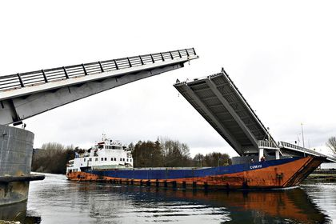

**Proyecto LVC: Puente levadizo** 
===================

**Daniel Gaspar Figueiredo**

Descripción 
-----------

*Una ciudad está separada en dos zonas por un río. Para circular entre
ambas zonas solo se puede acceder en automóvil a través de un puente
levadizo que las conecta. A su vez, por el río circulan barcos de carga
y descarga de mercancías. Nuestro sistema será el encargado de controlar
el estado del puente levadizo y de dar orden de paso a los vehículos o a
los barcos.*

\
 *Cabe destacar que mientras el puente esté levantado solo podrán pasar
los barcos, en caso contrario, solo podrán pasar los coches. Para este
sistema se van a proponer unos máximos de coches y/o barcos circulando a
la vez.\
 En el Esquema del sistema se pueden ver los agentes y las
comunicaciones que se proponen.*\
 *El objetivo de verificación es asegurar que no haya conflictos de
concurrencia en el pasaje de los vehículos. Debemos poder asegurar que
tanto coches como barcos pasan cuando deben de pasar para evitar
accidentes o incluso pérdidas humanas.*

Modelo 
------

*Se han tomado las siguientes decisiones en cuanto al modelado del
sistema*

El modelo tendrá 3 agentes (barco, coche, puente) y un único canal de
comunicación global.

Estos 3 agentes actuarán en función de los estados que tenga cada
instancia.

-   Se considera un máximo de 3 instancias de cada agente (excepto del
    puente, que solo tendrá una instancia
-   El puente tendrá una capacidad máxima de 2 vehículos similares (del
    mismo tipo) cruzando a la vez.
-   El puente será el orquestador de los demás agentes.
-   Se pretende que el sistema sea realista, por lo que se ha añadido un
    tiempo de cruzado (ver variables internas de los agentes) y un
    tiempo para bajar o levantar del puente.

Se ha limitado a 3 vehículos porque queremos probar que es posible tener
concurrencia en el puente (tener mas de 1 vehiculo a la vez) y a su vez,
queremos probar que si el puente esta lleno, el último vehículo se
espera para cruzar. 

En cuanto a la implementación, los agentes los implementaremos usando un
array de proctypes:

            active [3] proctype car() {
            ...
            }
            active [3] proctype ship() {
            ...
            }
            active proctype brdige(){
            ...
            }

Cada uno de estos agentes tendrá unas variables internas para poder
gestionar el estado de cada una de las instancias. Las variables que se
van a usar son las siguientes:

            //Para todos
            pid my_id = _pid;
            int crossing_time = 0;
            int waiting_time = 0;
            mtype s_response;
            bool asked = 0;
    
            //Para los coches
            mtype car_state = waiting;
    
            //para los barcos
            mtype ship_state = waiting;

Las variables \` \*\_state\`  podrán tomar únicamente 2 valores:
{waiting, crossing}. Cuando "aparece" un vehículo, este se pone
directamente en espera, pues no puede actuar sin que el agente
\`puente\` le ordene. El resto de variables servirán para simular el
tiempo cruzando el puente, para saber si esta instancia ya ha enviado
una petición para cruzar el puente para evitar enviar múltiples
peticiones. Además también se usa una variable para guardar la respuesta
a una petición. Esta variable (\`s\_response\`) puede tomar los valores
{ship\_wait, ship\_cross, car\_wait, car\_cross}.

Las acciones que realizan los agentes (coches y barcos) serán las de
pedir el paso, recibir una respuesta o cruzar el puente. Para ello se
implementará de la siguiente forma:

            :: atomic { (asked == 0 && car_state != crossing  && cur_seq_car < max_seq_car) -> ask_cross[my_id] = 1; action!car_ask,1, my_id; asked = 1 }
    
            :: atomic {
                        (car_state == crossing) ->
                            if
                                ...
                            fi
                        }
            :: atomic{ (asked == 1) ->
                        response?s_response, 1, eval(my_id);
                        if
                            ...
                        fi
                        }

El ejemplo es del agente coche.

El canal de comunicación tendrá 3 variables asociadas, estas serán: la
acción a realizar, el ID del TIPO de vehiculo y el ID del vehículo.

Para los coches usaremos el "id de tipo vehiculo = 1" y para los barcos
usaremos el "id de tipo vehiculo = 2". Es importante que se envíe el ID
del vehículo para que el puente sepa quién envía la petición y a quién
debe responder.

 

El puente tratará las peticiones una tras otra de forma atómica. No
"leerá" una segunda petición  hasta que no termine todo el tratamiento
de la primera. Las casuísticas detectadas han sido las siguientes:

-   Para peticiones provenientes de los coches:
    -   El puente está bajado
        -   El coche que pide, cabe en el puente (no llega al máximo de
            coches): **Le responde que cruce**
        -   El coche que pide no cabe en el puente: **Le responde que
            espere**
    -   El puente esta levantado: En cualquier caso **Le responde que
        espere**
        -   Si hay barcos cruzando: **Le responde que espere**
        -   Si no hay barcos cruzando: Baja el puente y **Le responde
            que espere.**
    -   Han habido al menos 3 coches antes que han pedido para cruzar y
        no ha cruzado ningún barco desde entonces: **Le responde que
        espere**

-   Para peticiones provenientes de los barcos:
    -   El puente está levantado
        -   El barco que pide, cabe en el puente (no llega al máximo de
            barcos): **Le responde que cruce**
        -   El barco que pide no cabe en el puente: **Le responde que
            espere**
    -   El puente esta bajado: En cualquier caso **Le responde que
        espere**
        -   Si hay coches cruzando: **Le responde que espere**
        -   Si no hay coches cruzando: Levanta el puente y **Le responde
            que espere.**
    -   Han habido al menos **1** barcos antes que han pedido para
        cruzar y no ha cruzado ningún coche desde entonces: **Le
        responde que espere**

Las casuísticas anteriores, marcadas en azul sirven para implementar
justicia y no permitir que crucen barcos sin parar, dejando a los coches
parados y esperando infinitamente.

*El modelo formal PROMELA es el siguiente:*

                mtype = {car_ask, ship_ask, car_wait, ship_wait, car_cross, ship_cross, crossing, waiting, raise_bridge, lower_bridge,  raising, lowering, raised, lowered, car_end, ship_end};
            mtype bridge_state =  lowered;
            mtype order;
            int car_count = 0;
            int ship_count = 0;
            int max_car = 2;
            int max_ship = 2;
            int type_id;
            pid vehicle_id;
            int max_crossing_time = 2;
            int max_waiting_time = 2;
            int max_rt = 1;
            int max_lt = 1;
            bool moving_bridge = 0;
    
            int max_seq_car = 3;
            int max_seq_ship = 1;
            int cur_seq_car = 0;
            int cur_seq_ship = 0;
    
            byte ask_cross[6];
    
            int semaphore_time; // por ahora no he visto como implementar esta funcionalidad.
    
            chan action = [0] of {mtype, int, pid}; // El int se usa para pasar el orden de los coches (el uid del coche) para asegurar que haya un orden (y barcos)
            chan response = [0] of {mtype, int, pid }; 

            active [3] proctype car() {
                pid my_id = _pid;
                mtype car_state = waiting;
                int crossing_time = 0;
                int waiting_time = 0;
                mtype s_response;
                bool asked = 0;
                do
                    :: atomic { (asked == 0 && car_state != crossing  && cur_seq_car < max_seq_car) -> ask_cross[my_id] = 1; action!car_ask,1, my_id; asked = 1 }
                    :: atomic {
                        (car_state == crossing) ->
                            if
                                :: (crossing_time < max_crossing_time) -> crossing_time ++
                                :: (crossing_time >= max_crossing_time ) -> ask_cross[my_id] = 0; car_state = waiting; crossing_time = 0; asked = 0; action!car_end,2, my_id
                            fi
                        }
                     :: atomic{ (asked == 1) ->
                        response?s_response, 1, eval(my_id);
                        if
                            :: (s_response == car_wait) -> car_state = waiting; asked = 0
                            :: (s_response == car_cross) -> ask_cross[my_id] = 2; car_state = crossing; asked = 0
                        fi
                        }
                od
            }
    
            active [3] proctype ship() {
                pid my_id = _pid;
                mtype ship_state = waiting;
                int crossing_time = 0;
                int waiting_time = 0;
                mtype s_response;
                bool asked = 0;
                do
                    :: atomic { (asked == 0 && ship_state != crossing && cur_seq_ship < max_seq_ship) -> ask_cross[my_id] = 1;  action!ship_ask,2, my_id; asked = 1 } 
                    :: atomic {
                        (ship_state == crossing) ->
                            if
                                :: (crossing_time < max_crossing_time) -> crossing_time ++
                                :: (crossing_time >= max_crossing_time ) -> ask_cross[my_id] = 0 ; ship_state = waiting; crossing_time = 0; asked = 0; action!ship_end,2, my_id
                            fi
                        }
                    :: atomic{ (asked == 1) -> 
                        response?s_response, 2, eval(my_id);
                        if
                            :: (s_response == ship_wait) -> ship_state = waiting; asked = 0
                            :: (s_response == ship_cross) -> ask_cross[my_id] = 2; ship_state = crossing; asked = 0
                        fi
                        }
                od
            }
    
            active proctype brdige(){
                
                int raising_time = 0;
                int lowering_time = 0;
                start : do
                    :: atomic { (moving_bridge == 0) -> action?order, type_id, vehicle_id;
                        if
                            :: (order == car_ask && bridge_state == lowered && car_count < max_car) ->  cur_seq_ship = 0; cur_seq_car++; car_count++; response!car_cross,type_id, vehicle_id
                            :: (order == ship_ask && bridge_state == raised && ship_count < max_ship) -> cur_seq_car = 0; cur_seq_ship++; ship_count++; response!ship_cross,type_id, vehicle_id
    
                            :: (order == car_ask && cur_seq_car >= max_seq_car) -> response!car_wait,type_id, vehicle_id
                            :: (order == ship_ask && cur_seq_ship >= max_seq_ship) -> response!ship_wait,type_id, vehicle_id

                            :: (order == car_ask && bridge_state == raised && ship_count > 0) -> response!car_wait,type_id, vehicle_id
                            :: (order == ship_ask && bridge_state == lowered && car_count > 0) -> response!ship_wait,type_id, vehicle_id
                            
                            :: (order == car_ask && bridge_state == lowered && car_count >= max_car) -> response!car_wait,type_id, vehicle_id
                            :: (order == ship_ask && bridge_state == raised && ship_count >= max_ship) -> response!ship_wait,type_id, vehicle_id
                            
                            :: (order == car_end) ->  car_count--
                            :: (order == ship_end) ->  ship_count--
                            :: (order == car_ask && bridge_state == raised && ship_count == 0) ->bridge_state = lowering; moving_bridge = 1 
                            :: (order == ship_ask && bridge_state == lowered && car_count == 0) ->bridge_state = raising; moving_bridge = 1 
                        fi
    
                    }
                    :: atomic { (moving_bridge == 1) -> 
                        if
                            :: (bridge_state == raising && raising_time < max_rt ) -> raising_time ++
                            :: (bridge_state == lowering && lowering_time < max_lt) -> lowering_time ++
                            :: (bridge_state == raising && raising_time >= max_rt) -> cur_seq_car = 0; cur_seq_ship++; raising_time = 0; bridge_state = raised; ship_count ++; moving_bridge = 0; response!ship_cross,type_id, vehicle_id
                            :: (bridge_state == lowering && lowering_time >= max_lt) -> cur_seq_ship = 0; cur_seq_car++; lowering_time = 0; bridge_state = lowered; car_count ++; moving_bridge = 0; response!car_cross,type_id, vehicle_id 
                        fi
    
                     }
                od
                    
            }

​            
​            

### Refinamientos del modelo 

Se ha remodelado porque:

-   Había *deadlocks*
-   Los procesos tenían un estado *waiting* que no servía
-   Errores de sintaxis: Un canal tenia solo 1 parámetro definido y
    cuando se usaba se enviaban más datos.
-   Se ha añadido el tratamiento de *raising* y *lowering* del puente.
-   Cuando el límite de coches estaba cruzando el puente y llegaba otra
    petición, no se trataba: Se ha añadido el caso
    `(order == car_ask && bridge_state == lowered && car_count >= max_car)` 
    y su análogo para el barco.
-   Se ha hecho distinción de los estados tanto del puente como de los
    demás agentes:
    -   El puente ahora está :
        -   moviéndose
        -   tratando peticiones
    -   Los demás agentes:
        -   Cruzando
        -   Enviando petición
        -   Recibiendo respuesta

Es decir, se ha eliminado el estado *waiting*.

Para poder hacer esta simulación, se ha ampliado el espacio de búsqueda
y la memoria.

Tras comprobar que todos estos cambios, aparentemente, funcionan, se han
ampliado el numero de agentes, Ahora disponemos de 3 coches en total, y
3 barcos. Simultáneamente en el puente pueden haber 2 como máximo del
mismo tipo.

 

### Verificación

*Los objetivos de verificación son los siguientes:*

-   *Garantizar que no se sobrepase el número máximo de coches
    permitidos cruzando simultáneamente el puente.*
-   *Garantizar que no se sobrepase el número máximo de
    barcos permitidos cruzando simultáneamente el puente.*
-   *Garantizar que si el puente esta subido, no hay coches cruzando*
-   *Garantizar que si el puente esta bajado, no hay barcos cruzando.*
-   *Garantizar que el puente no se mueve si hay algún vehículo
    cruzando.*
-   *Garantizar que si el puente se esta moviendo, en algún momento
    terminará de moverse para permitir a los vehículos pasar.*
-   *Garantizar que si un vehículo pide para cruzar, en algún momento
    pasará.*

*Lo que ha dado lugar a las siguientes propiedades LTL verificadas o
refutadas:*

 

            ltl max_cars { [] (car_count <= max_car)}
    
            ltl max_ships { [] (ship_count <= max_ship)}
    
            ltl crossing_cars { []  ( (bridge_state == lowered) -> (ship_count == 0) )}
    
            ltl crossing_ships { []  ( (bridge_state == raised) -> (car_count == 0) )} 
    
            ltl no_moving_bridge {[] ( (moving_bridge == 1) -> (car_count == 0 && ship_count == 0) ) }
    
            ltl bridge_states_raise { [] ( ( (moving_bridge == 1)  && (bridge_state == raising) ) -> <> ( ( moving_bridge == 0) && (bridge_state == raised))) }
    
            ltl bridge_states_lower {[] ( ( (moving_bridge == 1)  && (bridge_state == lowering) ) -> <> ( ( moving_bridge == 0) && (bridge_state == lowered))) }
    
            // ltl v_asks {[] ( ((ask_cross[0]==1) -> <> (ask_cross[0] == 2 ) ) || ((ask_cross[1]==1) -> <> (ask_cross[1] == 2 )) || ((ask_cross[2]==1) -> <> (ask_cross[2] == 2 )) || ((ask_cross[3]==1) -> <> (ask_cross[3] == 2 )) || ((ask_cross[4]==1) -> <> (ask_cross[4] == 2 )) || ((ask_cross[5]==1) -> <> (ask_cross[5] == 2 )) )}
    
            //Nueva versión
            ltl v_asks {[] ( ((ask_cross[0]==1) -> <> (ask_cross[0] == 2 ) ) && ((ask_cross[1]==1) -> <> (ask_cross[1] == 2 )) && ((ask_cross[2]==1) -> <> (ask_cross[2] == 2 )) && ((ask_cross[3]==1) -> <> (ask_cross[3] == 2 )) && ((ask_cross[4]==1) -> <> (ask_cross[4] == 2 )) && ((ask_cross[5]==1) -> <> (ask_cross[5] == 2 )) )}

**La última propiedad no se ha podido verificar porque aunque se haya
implementado justicia, está a nivel de tipo de vehículo y no a nivel de
vehículo individual. Por lo que no se puede asegurar que un vehículo
determinado pase. Para solucionar esto debemos combinar esta justicia
con una gestión de colas o un semáforo.**

### Refinamientos requeridos por la verificación 

Para asegurar que no habrá *starvation *(inanición) se ha ampliado el
modelo para que implemente justicia. Se han usado las variables enteras
\`max\_seq\_car\`, \`max\_seq\_ship\`, \`cur\_seq\_car\`,
\`cur\_seq\_ship\`.

\`max\_seq\_\*\` sirve para establecer el numero máximo de vehículos del
mismo tipo que pasan seguidos. Se ha limitado a 3 porque los cambios de
este valor u otro más alto no son significativos y debemos tener el
modelo lo más simple posible. No se usan limites de 0-2 porque queremos
que puedan haber al menos 2 vehículos del mismo tipo a la vez en el
barco y que un tercero se quede en espera.

**Cambio: **Para relajar la justicia, solo pedimos 1 barco y 3 coches.

Además, para poder controlar qué vehículos han pedido para cruzar o han
cruzado cruzado se ha creado un vector de bytes de tamaño 6 (1 por
vehículo) . Cada elemento de este vector podrá tener 3 valores:

-   Valor "0": Valor de inicialización
-   Valor "1": El vehículo ha pedido para pasar.
-   Valor "2": El vehículo está pasando.

<!-- -->

            byte ask_cross[6];

De esta forma, la LTL para asegurarse que si un vehículo pide para pasar
(Valor "1"), entonces en algún momento cruzará (Valor "2") consiste en
comprobar este vector.

Las verificaciones han dado lugar a cambios en el modelo:

-   Actualización de variables para para implementar justicia
-   Actualización del vector "*ask\_cross*"

 

            //para los coches (similar en barcos)...
            :: atomic { (asked == 0 && car_state != crossing  && cur_seq_car < max_seq_car) -> ask_cross[my_id] = 1; action!car_ask,1, my_id; asked = 1 }
    
            :: (crossing_time >= max_crossing_time ) -> ask_cross[my_id] = 0; car_state = waiting; crossing_time = 0; asked = 0; action!car_end,2, my_id
    
            :: (s_response == car_cross) -> ask_cross[my_id] = 2; car_state = crossing; asked = 0

            //Para el puente
            :: (order == car_ask && bridge_state == lowered && car_count < max_car) ->  cur_seq_ship = 0; cur_seq_car++; car_count++; response!car_cross,type_id, vehicle_id
    
            :: (order == ship_ask && bridge_state == raised && ship_count < max_ship) -> cur_seq_car = 0; cur_seq_ship++; ship_count++; response!ship_cross,type_id, vehicle_id
    
            :: (order == car_ask && cur_seq_car >= max_seq_car) -> response!car_wait,type_id, vehicle_id
            :: (order == ship_ask && cur_seq_ship >= max_seq_ship) -> response!ship_wait,type_id, vehicle_id
    
            :: (bridge_state == raising && raising_time >= max_rt) -> cur_seq_car = 0; cur_seq_ship++; raising_time = 0; bridge_state = raised; ship_count ++; moving_bridge = 0; response!ship_cross,type_id, vehicle_id
    
            :: (bridge_state == lowering && lowering_time >= max_lt) -> cur_seq_ship = 0; cur_seq_car++; lowering_time = 0; bridge_state = lowered; car_count ++; moving_bridge = 0; response!car_cross,type_id, vehicle_id 

 

### Conclusiones

Dificultades

Lo más costoso ha sido la búsqueda de errores detectados en fase de
verificación. Es decir, en un momento dado, se creía que el sistema
tenía un comportamiento que, tras usar una LTL para verificarlo, no se
cumplía. Se ha tenido que rehacer el modelo porque tras analizar algunas
trazas se veía que habían estados que no aportaban nada al sistema.
Eliminar estos estados forma parte de otra de las tareas más costosas en
este proyecto: reducir el espacio de búsqueda de los estados. Debemos
tener en cuenta que estamos limitados por un tamaño de estados máximo y
por una memoria física disponible, por lo que debemos abstraer al máximo
nuestro modelo.

Otro de los problemas han sido la simulación del tiempo. Para hacer el
sistema medianamente realista, se ha añadido un "tiempo de cruzado",
esto es, el tiempo que tarda un coche o un barco en cruzar el puente. Se
ha detectado en algunas trazas que un coche podía empezar a cruzar el
puente y luego no actualizaba el tiempo porque el sistema no le daba
paso en la ejecución. 

Propuestas de mejora

Como mejora para este proyecto se ha detectado que la propuesta para
implementar justicia no es suficientemente realista o buena. Es decir,
lo que se ha implementado es: "solo pueden pasar 3 vehiculos del mismo
tipo consecutivamente, tras estos 3 deben pasar de forma obligatoria 3
vehículos del tipo contrario". Lo cual, no es para nada realista. Lo
mejor sería, por ejemplo, implementar un semáforo. De manera que pasen 3
vehículos del mismo tipo y después se active el semáforo para los del
tipo contrario. Si pasado *"X"* tiempo no ha cruzado ninguno, vuelven a
pasar los del tipo inicial.

En un caso práctico; imaginando que hay 9 coches y 1 barco y primero
(por el motivo que sea) cruza un coche, El sistema actual se quedaría
bloqueado en "Han pasado 3 coches y 1 barco, el resto de coches están
esperando (a que pasen 2 barcos más)".

En la verificación, actualmente tenemos la ltl "v\_asks" que verifica
que "si cualquier vehículo pide para pasar, en algún momento pasará".
Realmente lo que se quería verificar es que "si **algún** vehículo pide
para pasar, en algún momento pasará". No se ha conseguido verificar esta
última propiedad. Probablemente, con a la propuesta de mejora mencionada
anteriormente (semáforo) se podría verificar.

En cuanto a la dificultad de la simulación de tiempo, propondría hacer
un contador global de acciones y basarse en este contador para priorizar
a los agentes que lleven más tiempo sin realizar acciones.

 

Aunque una verificación no se cumpla, no tiene porque estar mal. Es
decir, justificar que una propiedad no es cumple puede enriquecer la
compresión del modelo. Por ejemplo,  no podemos asegurar
que **todos** los vehículos puedan pasar porque el modelo no lo permite.
Esto lo hemos averiguado gracias a que no se cumple una de las
propiedades de verificación.

 

Punto de vista personal

Creo que con SPIN y PROMELA podemos realizar modelos de cualquier tipo
de sistema para verificar propiedades concurrentes. Sin embargo, la
complejidad de implementación y de abstracción deben estar muy bien
cuidadas. Hay que tener en cuenta la escalabilidad del modelo, por
ejemplo, en el caso del puente se han usado únicamente 3 coches y 3
barcos porque es la cantidad mínima y hay que tener en cuenta que el
sistema debe funcionar igual con 6 vehículos que con miles de ellos (en
la verificación sería imposible computacionalmente con un sistema con
miles de agentes, por eso abstraemos).

 
